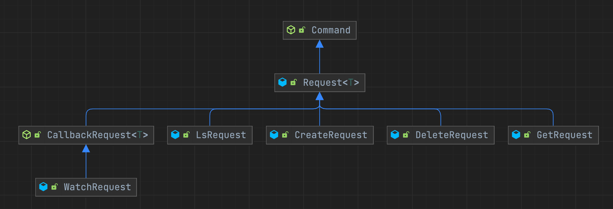

# zookits
使用[apache ratis](https://ratis.apache.org/)模拟了一些zk的功能
- 支持节点的创建、删除、查询等功能
- 支持节点的创建与删除事件的watch


支持的请求如下




server端运行`ZookitsServerTest.start`
client端运行`ZookitsClientTest`


[ratis](https://ratis.apache.org/)已经为我们解决了底层的分布式共识问题，对于上层应用者，只需要处理自身的逻辑即可，处理逻辑的入口就是状态机`StateMachine`。例如本项目中，对状态机进行了重写，在状态机中对客户端请求的进行管理。

- `applyTransaction`：客户端发起的事务请求处理入口，一般为写请求
- `query`：客户端发起的非事务请求处理入口，一般为读请求
- `takeSnapshot`：对当前状态机进行快照，一般是事务数量达到一定的阈值就会触发


### 使用示例


创建节点

```java
                client.sendRequest(
                        new CreateRequest()
                                .setPath(path)
                );
```


删除节点

```java
client.sendRequest(
                new DeleteRequest()
                        .setPath(path)
        );
```


监听节点删除事件

```java
        WatchRequest watchRequest = new WatchRequest();
        watchRequest.setPath(path);
        watchRequest.setType(WatchRequest.Type.DELETE);
        watchRequest.setCallback(System.out::println);
        client.callRequest(watchRequest);
```

